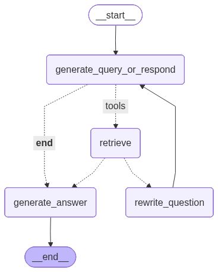

# 🥩 Aajonus Bot

AI chatbot simulating **Aajonus Vonderplanitz**, creator of the Primal Diet. Combines **semantic search** with real-time token streaming to answer questions directly from his works.


## Features

* Agentic RAG-based Chatbot
* Semantic search over a FAISS vector store of his writings.

## Installation & Usage

```bash
git clone https://github.com/Schiffer116/aajonus_bot.git
cd aajonus_bot
make build
make run
```

Open `http://localhost:8000` and start chatting.

## Agent workflow


## Tech Stack

Python, FastAPI, FAISS, HuggingFace embeddings, LangChain, LangGraph, React.
